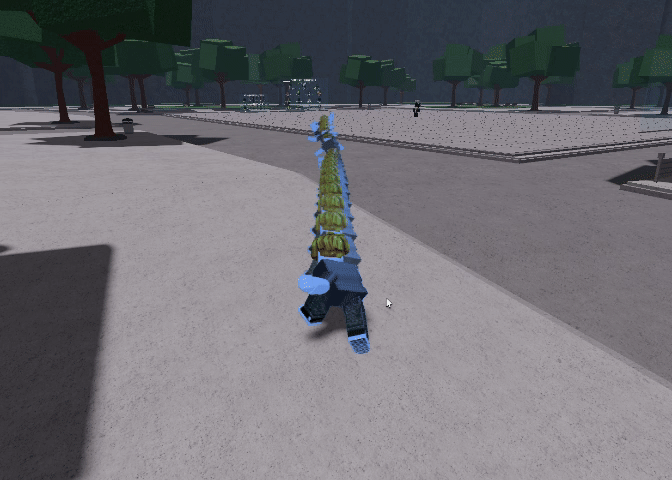
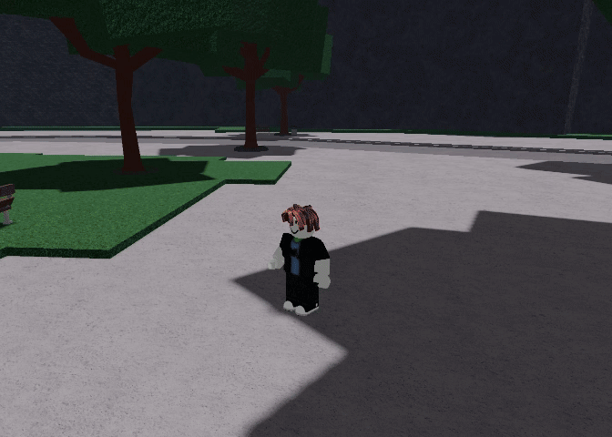

markdown
# projection

a roblox character projection / afterimage system that spawns ghost clones of your character along a customizable path with animation support, shard effects, viewport rendering, and trail modes

---

## changelog

### v1.1.0
- added `FrameOffset` config option and `:SetFrameOffset(n)` method. shifts the visible window forward by n frames relative to the playhead, so the projection does not overlap your real character when `MovePlayer` is enabled
- added `:SetLivePath(func)` method. lets you supply a callback that recomputes pivots live every heartbeat for predicting curves, turning, custom motion, etc. signature: `function(frameIdx, totalFrames, t, oldPivots, self) -> CFrame`
- added `:ClearLivePath()` to remove the live path callback
- live path updates re-pivot existing pooled projections in place instead of destroying and recreating them, so there is no flicker

### v1.0.0
- initial release

---

## table of contents

- [installation](#installation)
- [quick start](#quick-start)
- [constructor](#constructor)
- [configuration options](#configuration-options)
- [path functions](#path-functions)
- [easing functions](#easing-functions)
- [time easing](#time-easing)
- [methods](#methods)
- [live path / prediction](#live-path--prediction)
- [frame offset](#frame-offset)
- [animation segments](#animation-segments)
- [viewport mode](#viewport-mode)
- [trail mode](#trail-mode)
- [callback](#callback)
- [examples](#examples)

---

## installation

```lua
local Projection = loadstring(game:HttpGet("https://raw.githubusercontent.com/ProudNamed/ProjectionModule/refs/heads/main/projection.lua"))()
```

---

## quick start

```lua
local proj = Projection.new({
    StartPosition = CFrame.new(0, 5, 0),
    EndPosition = CFrame.new(50, 5, 0),
    Frames = 30,
    Duration = 1.5,
    AnimationId = 12345678,
    Color = Color3.fromRGB(144, 213, 255),
})

proj:Play()
```

---

## constructor

```lua
Projection.new(config)
```

creates a new projection instance with the given configuration table and returns the projection object

---

## configuration options

| key | type | default | description |
|----|----|----|----|
| Player | Player | Players.LocalPlayer | player whose character is cloned |
| StartPosition | CFrame | character pivot | starting cframe |
| EndPosition | CFrame | auto from start | ending cframe |
| Frames | number | 60 | total projection frames |
| Duration | number | 2 | playback duration (seconds) |
| ShardCount | number | 5 | shard fragments per part |
| ShardLife | number | 0.8 | shard lifetime |
| VisibleWindow | number | 0 | active projections at once |
| FrameOffset | number | 0 | how many frames the visible window sits ahead of the playhead. useful to avoid overlapping your character |
| Color | Color3 | (144,213,255) | projection color |
| Transparency | number | 0.75 | base transparency |
| PathFunc | function | Projection.Path.Linear | path function |
| PathArgs | table | {} | extra path arguments |
| MovePlayer | boolean | true | move player during playback |
| PlayAnimation | boolean | true | play animation on player |
| AnchorPlayer | boolean | true | anchor humanoidrootpart |
| Interpolate | boolean | true | smooth interpolation |
| SettleTime | number | 0.1 | animation settle delay |
| UseViewport | boolean | false | viewport rendering |
| TrailMode | boolean | false | trail behavior |
| FadeTime | number | 0.5 | viewport fade time |
| FadeStyle | EasingStyle | Quad | fade easing style |
| FadeDirection | EasingDirection | Out | fade easing direction |
| AnimationId | number/string | nil | animation asset id |
| AnimationTimeStart | number | 0 | animation start time |
| AnimationTimeEnd | number | animation length | animation end time |
| AnimationReverse | boolean | false | reverse animation |
| AnimationSpeed | number | 1 | animation speed |
| AnimationFunc | function | nil | custom animation function |
| Segments | table | nil | animation segments |
| LivePathFunc | function | nil | callback that returns a cframe per frame, called every heartbeat. see [live path / prediction](#live-path--prediction) |

---

## path functions

all path functions follow:

```lua
function(t, p0, p1, ...)
```

access via `Projection.Path`

### basic paths

- Linear
- EaseIn
- EaseOut
- EaseInOut
- EaseInCubic
- EaseOutCubic
- EaseInOutCubic

### elastic / back

- EaseInElastic
- EaseOutElastic
- EaseInBack
- EaseOutBack

### curves

- QuadBezier (p2)
- CubicBezier (p2, p3)
- CatmullRom (p0_ext, p3_ext, tension)

### shapes

- Sine (amp, freq)
- Spiral (radius, rotations)
- SpiralIn
- SpiralOut
- Bounce (height)
- Arc (height)
- ZigZag (amp, segments)
- Wave (ampX, ampY, freqX, freqY)
- Figure8 (scaleX, scaleY)
- Heart (scale)
- Helix (radius, rotations, verticalAmp)

### using path args

```lua
Projection.new({
    PathFunc = Projection.Path.Arc,
    PathArgs = {15},
})

proj:SetPath(Projection.Path.Spiral, 5, 3)
```

---

## easing functions

supports all `Enum.EasingStyle` values:

Linear, Quad, Cubic, Quart, Quint, Sine, Exponential, Circular, Back, Elastic, Bounce

directions:
`Enum.EasingDirection.In`, `Out`, `InOut`

---

## time easing

`Projection.TimeEasing` controls animation time distribution

- Linear
- EaseIn
- EaseOut
- EaseInOut
- Hold
- HoldEnd
- Step(steps)
- Ping
- PingPong(cycles)

```lua
proj.AnimationFunc = function(i, n, t)
    local stepped = Projection.TimeEasing.Step(4)(t)
    return 12345678, stepped * animLength
end
```

---

## methods

### playback

```lua
proj:Play(callback)
proj:Stop()
proj:Destroy()
proj:IsActive()
```

callback signature:

```lua
function(currentFrame, pool, pivots, animData)
```

---

### configuration setters

all setters return `self`

```lua
proj:SetPath(func, ...)
proj:SetStart(cframe)
proj:SetEnd(cframe)
proj:SetDuration(seconds)
proj:SetFrames(count)
proj:SetViewportMode(enabled)
proj:SetTrailMode(enabled)
proj:SetFade(time, style, direction)
proj:SetColor(color)
proj:SetAnimation(animId, timeStart, timeEnd, reverse, speed)
proj:SetAnimationFunc(func)
proj:SetFrameOffset(n)
proj:SetLivePath(func)
proj:ClearLivePath()
```

---

## live path / prediction

`SetLivePath(func)` lets you fully replace the static `PathFunc` with a live, per-heartbeat computation. The module does not contain prediction logic itself, so you can implement whatever motion model you want (linear extrapolation, constant turn rate, polynomial fit, kalman, etc).

signature:

```lua
proj:SetLivePath(function(frameIdx, totalFrames, t, oldPivots, self)
    -- frameIdx     : 1..totalFrames, which frame's cframe is being requested
    -- totalFrames  : equal to self.Frames
    -- t            : (frameIdx - 1) / (totalFrames - 1), normalized 0..1
    -- oldPivots    : the current pivots table (you can read previous values)
    -- self         : the projection instance
    return CFrame.new(...) -- must return a CFrame
end)
```

the callback is invoked for every frame on every heartbeat. if you return a non-cframe or error, that frame keeps its previous value. existing live projections are re-pivoted in place when pivots change, so there is no destroy/recreate flicker.

### tips for performance

since the callback fires `Frames * heartbeatsPerSecond` times per second, do expensive work (history sampling, spline fitting, scanning the workspace) once per tick outside the callback, cache the result, and have the callback just read from the cache.

```lua
local cachedTrajectory = {}

task.spawn(function()
    while proj:IsActive() do
        -- expensive prediction once per heartbeat
        cachedTrajectory = computeTrajectory()
        game:GetService("RunService").Heartbeat:Wait()
    end
end)

proj:SetLivePath(function(i, n, t, old)
    return cachedTrajectory[i] or old[i]
end)
```

### example: constant turn rate prediction

predicts curves and turns based on current linear and angular velocity:

```lua
local player = game:GetService("Players").LocalPlayer

proj:SetLivePath(function(frameIdx, totalFrames, t, oldPivots, self)
    local char = player.Character
    local hrp = char and char:FindFirstChild("HumanoidRootPart")
    if not hrp then return oldPivots[frameIdx] end

    local pos     = hrp.Position
    local linVel  = hrp.AssemblyLinearVelocity
    local angVelY = hrp.AssemblyAngularVelocity.Y
    local look    = hrp.CFrame.LookVector
    local yaw     = math.atan2(-look.X, -look.Z)
    local speed   = Vector2.new(linVel.X, linVel.Z).Magnitude

    local dt = (self.Duration / (totalFrames - 1)) * (frameIdx - 1)
    local newYaw = yaw + angVelY * dt

    local dx, dz
    if math.abs(angVelY) > 0.01 then
        dx =  speed * (math.sin(newYaw) - math.sin(yaw)) / angVelY
        dz =  speed * (math.cos(yaw)    - math.cos(newYaw)) / angVelY
    else
        dx = -math.sin(yaw) * speed * dt
        dz = -math.cos(yaw) * speed * dt
    end

    return CFrame.new(pos + Vector3.new(dx, 0, dz)) * CFrame.Angles(0, newYaw, 0)
end)
```

---

## frame offset

`FrameOffset` shifts the visible window forward by N frames relative to the playhead. it does not move pivots in space; it only changes which frames are shown and which are shattered. this is useful when `MovePlayer = true` so the player's actual body does not overlap with the projection sitting on the same frame.

example:

```
FrameOffset = 0 (default):
  pivots:  1 2 3 4 5 6 7 8
  visible: 1 2 3 4 5 6 7 8   (frame 1 overlaps your character)
  char at: 1

FrameOffset = 1:
  pivots:  1 2 3 4 5 6 7 8
  visible: . 2 3 4 5 6 7 8   (frame 1 hidden, your character sits there)
  char at: 1
```

```lua
proj:SetFrameOffset(2) -- visible window now starts 2 frames ahead of the playhead
```

---

## animation segments

```lua
proj:AddSegment({
    AnimationId = 12345678,
    StartFrame = 1,
    EndFrame = 30,
    TimeStart = 0,
    TimeEnd = 1.5,
    Reverse = false,
    Speed = 1,
    Easing = nil
})

proj:ClearSegments()
```

positional syntax supported:

```lua
proj:AddSegment({12345678, 1, 30, 0, 1.5})
```

---

## viewport mode

when `UseViewport = true`:

- renders in a `ViewportFrame`
- smooth fade instead of shatter
- object pooling enabled
- original character appearance preserved
- color applied as image tint

```lua
Projection.new({
    UseViewport = true,
    FadeTime = 0.5,
    FadeStyle = Enum.EasingStyle.Quad,
})
```

---

## trail mode

when `TrailMode = true`:

- projections appear behind the player
- older frames are removed via window
- works in world and viewport modes

```lua
Projection.new({
    TrailMode = true,
    VisibleWindow = 10,
})
```

---

## callback

```lua
proj:Play(function(currentFrame, pool, pivots, animData)
    -- per-frame callback
end)
```

---

## examples

### basic linear

```lua
Projection.new({
    Frames = 30,
    Duration = 1,
    AnimationId = 12345678,
}):Play()
```

### arc path

```lua
Projection.new({
    PathFunc = Projection.Path.Arc,
    PathArgs = {20},
    Frames = 40,
    Duration = 1.5,
}):Play()
```

### spiral trail

```lua
Projection.new({
    PathFunc = Projection.Path.SpiralOut,
    PathArgs = {8, 4},
    TrailMode = true,
    VisibleWindow = 15,
    Frames = 60,
    Duration = 3,
}):Play()
```

### viewport fade

```lua
Projection.new({
    UseViewport = true,
    FadeTime = 0.8,
    Frames = 50,
    Duration = 2,
}):Play()
```

### streaming window

```lua
Projection.new({
    Frames = 200,
    Duration = 5,
    VisibleWindow = 20,
}):Play()
```

when `VisibleWindow` is set and frame count is high, streaming mode is enabled to limit memory usage

### live prediction (curves and turns)

```lua
local player = game:GetService("Players").LocalPlayer

local proj = Projection.new({
    AnimationId = 17354976067,
    Frames = 120,
    Duration = 6,
    VisibleWindow = 24,
    FrameOffset = 2,
    UseViewport = true,
    Color = Color3.fromRGB(80, 150, 255),
    SettleTime = 0,
    Interpolate = false,
    FadeTime = 0,
    AnimationTimeStart = 1.2,
    AnchorPlayer = false,
    MovePlayer = false,
})

proj:SetLivePath(function(i, n, t, old, self)
    local hrp = player.Character and player.Character:FindFirstChild("HumanoidRootPart")
    if not hrp then return old[i] end
    local pos = hrp.Position
    local v = hrp.AssemblyLinearVelocity
    local a = hrp.AssemblyAngularVelocity.Y
    local look = hrp.CFrame.LookVector
    local yaw = math.atan2(-look.X, -look.Z)
    local speed = Vector2.new(v.X, v.Z).Magnitude
    local dt = (self.Duration / (n - 1)) * (i - 1)
    local newYaw = yaw + a * dt
    local dx, dz
    if math.abs(a) > 0.01 then
        dx = speed * (math.sin(newYaw) - math.sin(yaw)) / a
        dz = speed * (math.cos(yaw) - math.cos(newYaw)) / a
    else
        dx = -math.sin(yaw) * speed * dt
        dz = -math.cos(yaw) * speed * dt
    end
    return CFrame.new(pos + Vector3.new(dx, 0, dz)) * CFrame.Angles(0, newYaw, 0)
end)

proj:Play()
```

## showcases

### normal projection with useviewport mode on

```lua
local Players = game:GetService("Players")
local player = Players.LocalPlayer
local hrp = player.Character.HumanoidRootPart
local startCF = hrp.CFrame
local endCF = startCF * CFrame.new(0, 0, -500)

local proj1 = Projection.new({
    AnimationId = 17354976067,
    Frames = 120,
    Duration = 6,
    VisibleWindow = 24,
    UseViewport = true,
    Color = Color3.fromRGB(80, 150, 255),
    SettleTime = 0,
    Interpolate = false,
    FadeTime = 0,
    AnimationTimeStart = 1.2,
    TrailMode = false,
    AnchorPlayer = false,
})

proj1:SetPath(Projection.Path.Linear)
proj1:SetStart(startCF)
proj1:SetEnd(endCF)
proj1:Play()
```

### showcase


### projection with trails and useviewport on + 2 projections without useviewport on a sine mirrored path

```lua
local Projection = loadstring(game:HttpGet("https://raw.githubusercontent.com/ProudNamed/ProjectionModule/refs/heads/main/projection.lua"))()
local Players = game:GetService("Players")
local player = Players.LocalPlayer
local hrp = player.Character.HumanoidRootPart
local startCF = hrp.CFrame
local endCF = startCF * CFrame.new(0, 0, -500)

local proj1 = Projection.new({
    AnimationId = 17354976067,
    Frames = 120,
    Duration = 6,
    VisibleWindow = 24,
    UseViewport = true,
    Color = Color3.fromRGB(80, 150, 255),
    SettleTime = 0,
    Interpolate = false,
    FadeTime = 0,
    AnimationTimeStart = 1.2,
    TrailMode = true,
    AnchorPlayer = false,
})

proj1:SetPath(Projection.Path.Linear)
proj1:SetStart(startCF)
proj1:SetEnd(endCF)

local proj2 = Projection.new({
    AnimationId = 17354976067,
    Frames = 80,
    Duration = 6,
    VisibleWindow = 10,
    UseViewport = false,
    Color = Color3.fromRGB(255, 100, 100),
    SettleTime = 0.05,
    Interpolate = false,
    FadeTime = 0.2,
    AnimationTimeStart = 1.2,
    TrailMode = false,
    MovePlayer = false,
    AnchorPlayer = false,
    PlayAnimation = false
})

proj2:SetPath(Projection.Path.Sine, 15, 3)
proj2:SetStart(startCF)
proj2:SetEnd(endCF)

local proj3 = Projection.new({
    AnimationId = 17354976067,
    Frames = 80,
    Duration = 6,
    VisibleWindow = 10,
    UseViewport = false,
    Color = Color3.fromRGB(100, 255, 100),
    SettleTime = 0.05,
    Interpolate = false,
    FadeTime = 0.2,
    AnimationTimeStart = 1.2,
    TrailMode = false,
    MovePlayer = false,
    AnchorPlayer = false,
    PlayAnimation = false
})

proj3:SetPath(Projection.Path.Sine, -15, 3)
proj3:SetStart(startCF)
proj3:SetEnd(endCF)

proj1:Play()
proj2:Play()
proj3:Play()
```
### showcase

```
